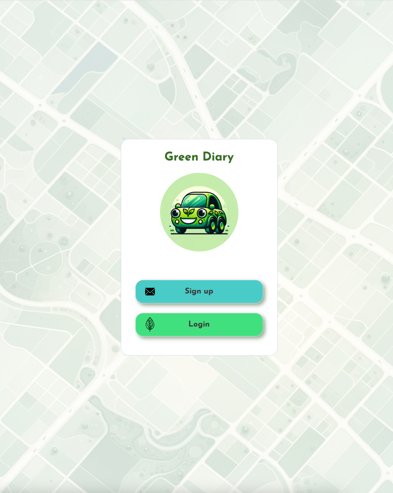
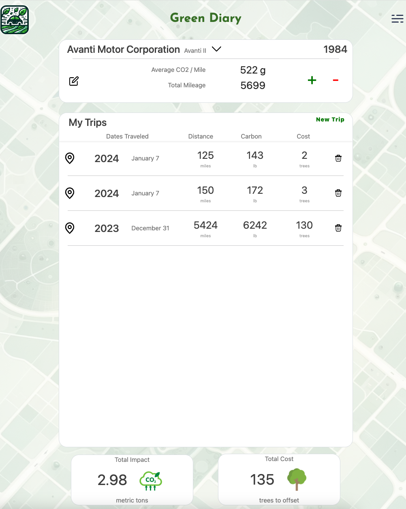
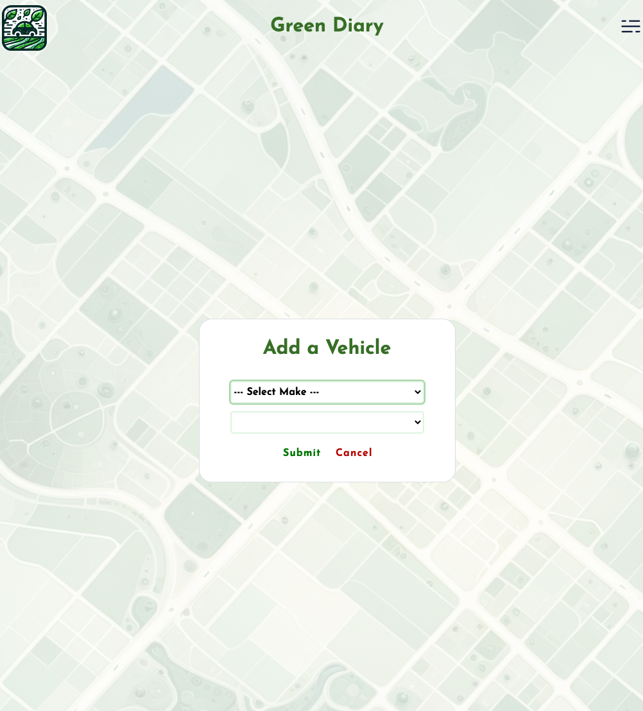

# Green Diary

Green Diary is an innovative CO2 tracking platform that helps you monitor the environmental impact of your vehicle trips. By understanding the carbon footprint of your travels, Green Diary aims to foster more eco-conscious decisions and behaviors.

## Features

- **CO2 Emission Tracking**: Calculates the amount of CO2 emitted on each trip based on your vehicle's make and model.
- **Tree Mitigation Estimates**: Provides insights into the number of trees required to offset your trip's carbon emissions.
- **Vehicle Database**: Utilizes various APIs to prepopulate vehicle makes and models for easy selection and accurate emission data.
- **User-Friendly Interface**: Built with Django and Bootstrap, the platform offers a responsive and intuitive user experience.

## Technologies Used

- **Django**: A high-level Python Web framework that encourages rapid development and clean, pragmatic design.
- **Bootstrap**: For responsive design, ensuring the application is mobile-friendly and accessible on various devices.
- **PostgreSQL**: A powerful, open-source object-relational database system.
- **HTML**: For structuring the platform's web pages.
- **CSS**: For styling the platform's web pages.
- **Django Authentication**: For managing user accounts and authentication within the application.
- **Google Authentication**: To allow users to sign in with their Google accounts for a faster and secure login experience.
- **Third-Party APIs**: Integration of external APIs to fetch vehicle data and calculate emissions accurately.

## Live Website

The Green Diary platform is now live and accessible! Visit us at [Green Diary](https://green-diary-app-2098e92803f3.herokuapp.com/) to start tracking your CO2 emissions and making more eco-conscious travel decisions.

## Getting Started

To get started with Green Diary:

1. Clone the repository.
2. Install the required dependencies.
3. Set up your environment with the necessary API keys.
4. Run the application and begin tracking your CO2 emissions.

## Contribution

Contributions are welcome! If you have ideas for improvements or want to help in developing new features, please read the CONTRIBUTING.md file for guidelines.

## Acknowledgements

Special thanks to all the APIs and open-source projects that made Green Diary possible.

## Future Enhancement

1. Route planning within the app to receive the most carbon efficient route possible
2. Impact Statistics Visualization and Comparisons
3. Cost Calculation of Trips
4. Calendar View of Trips
5. Links to Tree-Planting Programs
